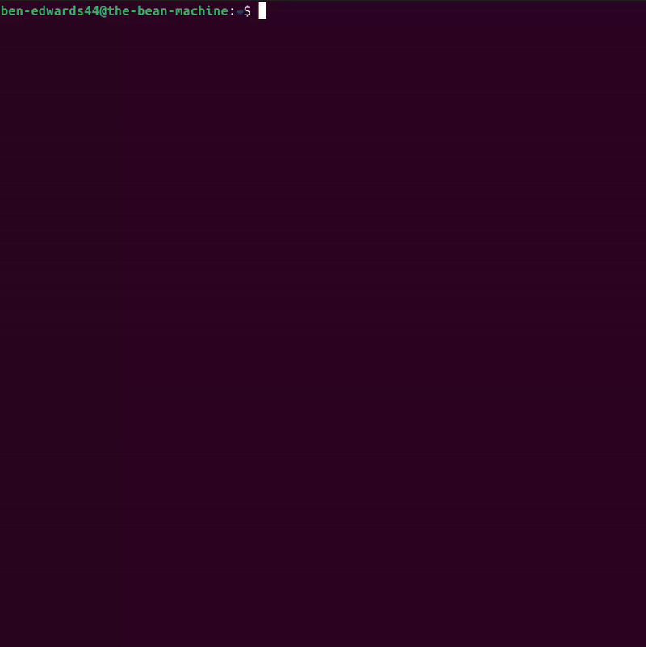
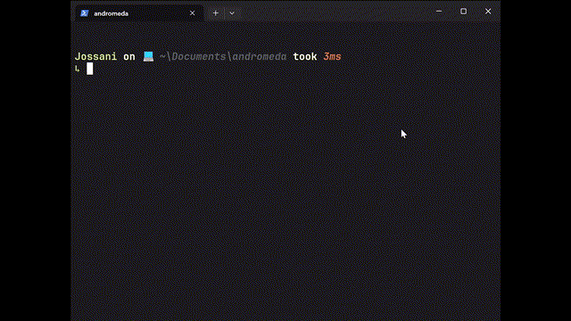
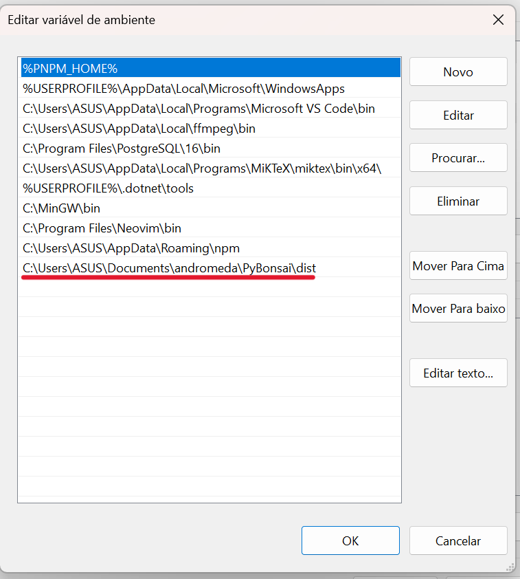

# PyBonsai :palm_tree:

PyBonsai is a Python script that generates procedural ASCII art trees in the comfort of your terminal.

## About :seedling:



PyBonsai is inspired by the amazing [cbonsai](https://gitlab.com/jallbrit/cbonsai) repository.
Whereas cbonsai grows bonsai trees, PyBonsai trees look more like trees you would find in a forest (oak, ash and so on).

The trees are configurable via CLI options to make them different sizes, more or less complex, grow at different rates, or use a different set of characters. See [useage](#useage-wrench) for more information.

Currently, PyBonsai supports 4 different types of tree. Details of these are shown in the [tree types](#tree-types-leaves) section.

PyBonsai uses [ANSI escape codes](https://en.wikipedia.org/wiki/ANSI_escape_code) for colouring characters. Almost all modern terminals will support this but, if yours does not, PyBonsai will not work.

If you encounter an issue with PyBonsai, or have an idea for an improvement, do not be afraid to open an issue.

## Installation :link:

Requirements:

- Python 3.9 or greater

To use PyBonsai, you need to first clone the repository:

    git clone https://github.com/Ben-Edwards44/PyBonsai.git

### Linux

To install for all users, run the included `install.sh` script to create a symlink in `/usr/local/bin`

    cd PyBonsai
    sudo bash install.sh

Verify the installation by running:

    pybonsai --version

### Windows

After cloning the repository you need to follow these steps in order to run PyBonsai in your terminal:

1. Install the `pyinstaller` package

```
pip install pyinstaller
```

> You may need to run the terminal in admin mode while installing `pyinstaller`

2. Change to the directory containing the cloned repo and run the `pyinstaller` command on `main.py`

```
cd directory-that-contains-pybonsai
pyinstaller main.py
```

This will create a new `dist` folder with an executable of the PyBonsai, you can test it by changing to the `dist` folder and running `main.exe`

```
cd dist
main.exe
```

You should see something like this:



<br />

Now rename the `main.exe` to `pybonsai.exe`

3. Copy the path of the `dist` folder and add it to your `Path` environment variable



<br />

Now you can run PyBonsai with the command `pybonsai.exe` or `pybonsai`

You can even pass flags

```
pybonsai --layers 10
```

### MacOS

Please note that PyBonsai has not been tested on MacOS, but I see no reason why it would not work on Mac OS.
To install PyBonsai, you will need to clone the repository and add it to your system's PATH.

## Usage :wrench:

Run `pybonsai --help` for useage:

    USEAGE pybonsai [OPTION]...

    PyBonsai procedurally generates ASCII art trees in your terminal.

    OPTIONS:
        -h, --help            display help
            --version         display version

        -s, --seed            seed for the random number generator

        -i, --instant         instant mode: display finished tree immediately
        -w, --wait            time delay between drawing characters when not in instant mode [default 0]

        -c, --branch-chars    string of chars randomly chosen for branches [default "~;:="]
        -C, --leaf-chars      string of chars randomly chosen for leaves [default "&%#@"]

        -x, --width           maximum width of the tree [default 80]
        -y, --height          maximum height of the tree [default 25]

        -t, --type            tree type: integer between 0 and 3 inclusive [default random]
        -S, --start-len       length of the root branch [default 15]
        -L, --leaf-len        length of each leaf [default 4]
        -l, --layers          number of branch layers: more => more branches [default 8]
        -a, --angle           mean angle of branches to their parent, in degrees; more => more arched trees [default 40]

        -f, --fixed-window    do not allow window height to increase when tree grows off screen

The following images demonstrate the use of the different options:

| Effect               | Image                                              |
| -------------------- | -------------------------------------------------- |
| Big tree             |                |
| Different characters |  |
| Longer leaves        |         |

## Tree Types :leaves:

PyBonsai supports 4 different tree types. Unless specified with the `--type` option, the tree type will be chosen at random.

All tree types are generated recursively and are, essentially, variations on [this](https://www.youtube.com/watch?v=0jjeOYMjmDU) basic fractal tree.

| Type             | Image                                       | Description                                                                                                              |
| ---------------- | ------------------------------------------- | ------------------------------------------------------------------------------------------------------------------------ |
| Classic          |        | The number of child branches is normally distributed with $\mu = 2$ and $\sigma = 0.5$.                                  |
| Fibonacci        |                | The number of branches on the $n^{th}$ layer is the $n^{th}$ fibonacci number.                                           |
| Offset fibonacci |  | Similar to above, except child branches grow in the middle of the parent as well as the end.                             |
| Random fibonacci |    | Similar to above, except child branches grow at random positions on the parent and leaves can grow in the middle layers. |
